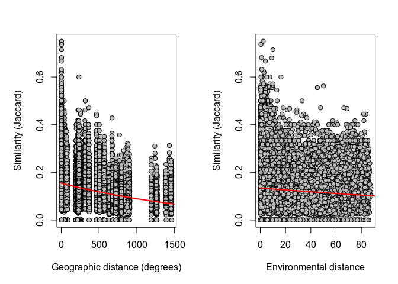

This script exemplifies analyses using a single taxonomic group. The
sripts uses For combined analyses without requiring repetition of this
code multiple times when analyzing multiple datasets contact the authors

# Import packages and functions

## Load R packages

For the analyses of this manuscript, we use four R packages that are
loaded using the code below. Other packages were used to extract
environmental data from raster files and to generate maps of the study
area. However, these steps are not shown in this tutorial.

``` r
library(vegan) # install.packages("vegan")
library(ecodist) # install.packages("ecodist")
library(MuMIn) # install.packages("MuMIn")
library(ape) # install.packages("ape")
```

## Load R functions created specifically for this paper

In addition to these R packages, functions were created to facilitate
some of the analyses (eg. multiple regression on distance matrices) for
several taxa simultaneously and for plotting the results from these
analyses. These functions are not available in R packages, but are
provided along with this tutorial and can be loaded using the `source`
function

``` r
# Script needs to be in the same folder as the `.RData` file
source("RFunctions.R") 

# Used if dissimilarities corrected for undersampling are used
source("https://raw.githubusercontent.com/csdambros/R-functions/master/chaodist.R") 
```

# Import data

The data used is provided in two tables with biotic and abiotic
information.

## Species occurrence data in long format

The `occLong` data is a table with the biotic data (species occurrences)
in the long format. The long format is ideal for storing data. In this
format, each row represents a record and all the raw information
collected in the sampling process can be maintained without losing
information. The information provided in these data has not been
modified or summarized in any way that could hide details or any
information about the individual records obtained for the specimens (as
would be the case if a presence x absence matrix was provided).

``` r
# Import the occLong table
occLong<-read.csv("occLongBioGeoAmazonia.csv")

# show first rows and columns of data
occLong[1:5,1:5]
```

    ##      ID            plotID  site module subplot
    ## 1 75883 BR319_M01_TN_0500 BR319    M01     230
    ## 2 75884 BR319_M01_TN_0500 BR319    M01      80
    ## 3 76032 BR319_M01_TN_0500 BR319    M01     180
    ## 4 76079 BR319_M01_TN_0500 BR319    M01      80
    ## 5 76146 BR319_M01_TN_0500 BR319    M01      80

## Environmental data

The `env` data is a table with the abiotic data (predictor variables).
In this table, each row represents a sampling site. The env data has
information for all sites in Amazonia included in the study, not only
for the taxa used for demonstration in this tutorial. The PlotID column
represents the site identification and has a matching column in the
occurrence table.

``` r
# Import the env table
env<-read.csv("envBioGeoAmazonia.csv")


# show first rows and columns of data
env[1:5,1:5]
```

    ##              plotID site  grid module SectionLength
    ## 1 BR319_M01_TN_0500 <NA> BR319    M01          <NA>
    ## 2 BR319_M01_TN_1500 <NA> BR319    M01          <NA>
    ## 3 BR319_M01_TN_2500 <NA> BR319    M01          <NA>
    ## 4 BR319_M01_TN_3500 <NA> BR319    M01          <NA>
    ## 5 BR319_M01_TN_4500 <NA> BR319    M01          <NA>

``` r
# Assign names for the rows of this table (important for analyses later)
rownames(env)<-env$plotID
```

## Data inputation

Unfortunately, not all sampling sites have environmental data. Some
sites, such as the Jaú National Park are in locations of difficult
access and only some data are available for this site. To use these data
in subsequent analyses, we performed data imputation. Imputation fills
the missing data and was performing by randomly selecting data from
other plots where data are available. This procedure is conservative
from the statistical point of view because it adds noise to the data
reducing the significance and explanatory power of predictor variables
(i.e. does not increase type I error rates. Any statistically
significant result would still be significant if the inputted data were
removed from analyses)
\[1\].

``` r
### Input missing clay data from other samples (random sample from other plots)
### !Adds noise to the data, potentially reducing the power of statistical tests

# Soil clay
env$clay<-ifelse(is.na(env$clay),
                 sample(env$clay[!is.na(env$clay)],replace = TRUE),
                 env$clay)

# Soil bases
env$SumofBases_cmol.log<-ifelse(is.na(env$SumofBases_cmol.log),
                                    env$KrigeSoil_fernR,
                                    env$SumofBases_cmol.log)
```

# Data preparation

## Create a short table (abundance x species matrix)

Although the `occLong` table has lots of information in detail, this
table needs to be modified into a short table to run the analyses. The
Jaccard similarity index and other metrics are measured by comparing
sites and species. To make these comparisons programs and functions
usually use a short table as input. The short table has sampling plots
as rows and species as columns and is filled with abundance or
presence/absence data for each species in each sampling plot. This short
table can be easily created from the `occLong` table using the `tapply`
function in R.

``` r
attach(occLong)

occAB<-tapply(n,list(plotID,species),sum)

## Replace NAs with zeroes
occAB<-ifelse(is.na(occAB),0,occAB)

detach(occLong)
```

The abundance table created above can be easily converted into a
presence-absence table by replacing values above 0 by 1, and leaving
values equal 0 as 0.

``` r
## Create Presence/Absence matrix
occPA<-ifelse(occAB>0,1,0)
```

## Check correlation between environmental variables

Results from multiple regression models can be misleading if correlated
variables are included because the model calculates partial p-values.
i.e. the association of a variable after the removal of the effect of
all other variables from the model. When variables are correlated to
each other, their association with the response variable cannot be
disentangled. Therefore, no effect can be detected after the removal of
one of the variables (it is almost as removing the variable itself\!).
Therefore, it is interesting to remove correlated variables before
running these models.

``` r
cor(env[,c("sa.latlong.treecover",
           "SumofBases_cmol.log",
           "clay",
           "CHELSA_bio_5",
           "CHELSA_bio_6",
           "CHELSA_bio_17")],
        use="pairwise.complete")
```

    ##                      sa.latlong.treecover SumofBases_cmol.log        clay
    ## sa.latlong.treecover           1.00000000        -0.020563865 -0.02110539
    ## SumofBases_cmol.log           -0.02056386         1.000000000 -0.01060797
    ## clay                          -0.02110539        -0.010607968  1.00000000
    ## CHELSA_bio_5                   0.13223819         0.003874775 -0.11319894
    ## CHELSA_bio_6                   0.08478933        -0.378614321  0.02444190
    ## CHELSA_bio_17                 -0.03641742        -0.274979880  0.11867099
    ##                      CHELSA_bio_5 CHELSA_bio_6 CHELSA_bio_17
    ## sa.latlong.treecover  0.132238187  0.084789332   -0.03641742
    ## SumofBases_cmol.log   0.003874775 -0.378614321   -0.27497988
    ## clay                 -0.113198940  0.024441900    0.11867099
    ## CHELSA_bio_5          1.000000000  0.005640386   -0.42615727
    ## CHELSA_bio_6          0.005640386  1.000000000    0.66584282
    ## CHELSA_bio_17        -0.426157272  0.665842816    1.00000000

In these data, only the climatic CHELSA\_bio\_5 (tempMax) and
CHELSA\_bio\_17 (precDryQ) will be used because they represent
temperature and precipitation and are not correlated to other variables.
Other predictor variables are not strongly correlated to each other and
are ok to be included as independent predictors. It is important to note
that the choice of what correlated variables will be included must be
based on the biological meaning of the variable, not only the
correlation to other variables.

## Select only plots in environmental data where the group occurs

This step is not necessary if the environmental data already has only
the plots where the focal group was obtained

``` r
env<-env[env$plotID%in%rownames(occPA),]
```

## Standardize predictor variables

Before running the analyses, we standardized all predictor and response
variables. By standardizing these variables, the coefficients for the
different response or predictor variables are proportional to the
variance explained by the variable and are perfectly comparable -
i.e. the coefficients are not affected by the magnitude or the variance
in the original values.

``` r
# Standardize predictor variables
envStd<-decostand(
  env[c("Long",
        "Lat",
        "clay",
        "sa.latlong.treecover",
        "SumofBases_cmol.log")]
  ,"standardize")

# Add biogeographic region to the data
# (this is a categorical predictor, not possible to standardize)
envStd$class_Ribas<-env$class_Ribas
```

# Data analysis

As described in the main text, we analyzed the data using two
approaches: Distance-based and Raw-data-based (see Tuomisto et al. 2008
for details)

## Distance-based approach (Multiple Regression Distance matrices)

### Create response variables - dissimilarity matrix

In the distance-based approach, the model is run using triangular
distance/dissimilarity matrices as predictors and response variables.
Here we use the pairwise Jaccard dissimilarity as the response variable.
The Jaccard dissimilarity measures the percentage of shared species
between each pair of plots. In the distance-based approach, the models
are used to answer “why some pairs of sites share fewer species than
other pairs / why some pairs of sites are less similar to each other”.

``` r
# Create matrix with the pairwise Jaccard dissimilarities
ecoDist<-vegdist(occPA,method="jaccard",na.rm = FALSE)

# Standardize dissimilarity
# (make coefficients compable among taxa in multiple-taxa comparisons)
ecoDistStd<-decostandDist(ecoDist,na.rm=TRUE)
```

In this example and the main manuscript, the classical Jaccard
dissimilarity index was used. However, two alternatives that are
sometimes used and the code to generate these dissimilarities are
presented below: Extended dissimilarities and the bias-corrected Jaccard
index proposed by Chao et al. (2005).

In case you want to use extended dissimilarities:

``` r
ecoDistExt<-stepacross(ecoDist)
```

In case you want to use the Chao method for Jaccard. The Chao method
corrects for non detected species but might require some amount of high-
quality data (not too many rare species)

This function can be obtained in
<https://raw.githubusercontent.com/csdambros/R-functions/master/chaodist.R>

Download to your local folder and then use

source(“chaodist.R”)

or

source(“PathToYourFolder/chaodist.R”)

ex. source(“C://users/…/chaodist.R”)

``` r
ecoDistChao<-chaodist(occAB)
```

### Create predictor variables - distance matrices

Now that we have created all response variables that will be used, we
only need to organize the predictor variables. In our case, we need to
create geographic and environmental distance matrices

Distances for predictor variables are calculated as the difference in
the values of the variable between each pair of plots (e.g. two sites
with temperatures of 20 and 21 degrees will be represented in the
pairwise distance matrix by the value of 21-20 = 1).

``` r
### Geographic distance in degrees 
# (converted to meters using the sp package in the main analyses in the paper)
geoDist<-dist(env[c("Long","Lat")])
  
### Environmental distance
treeCoverDist<-dist(env["sa.latlong.treecover"])
basesLogDist<-dist(env["SumofBases_cmol.log"])
clayDist<-dist(env["clay"])

tempMaxDist<-dist(env["CHELSA_bio_5"])
precDryQDist<-dist(env["CHELSA_bio_17"])


# Difference based on biogeographic region (0 if same, 1 otherwise)
regionRibasMat<-as.matrix(dist(as.integer(env$class_Ribas)))>0
rownames(regionRibasMat)<-labels(clayDist)
regionRibasDist<-as.dist(regionRibasMat)


# Create standardized matrices
geoDistStd<-decostandDist(geoDist)

treeCoverDistStd<-decostandDist(treeCoverDist)
basesLogDistStd<-decostandDist(basesLogDist)
clayDistStd<-decostandDist(clayDist)

tempMaxDistStd<-decostandDist(tempMaxDist)
precDryQDistStd<-decostandDist(precDryQDist)

regionRibasDistStd<-decostandDist(regionRibasDist)
```

#### The decay in species similarity with geographic and environmental distances

One of the most conspicuous patterns in ecology is the decay in species
similarity with geographic distance - i.e. the tendency to areas that
are closer to resemble each other more than areas that are separated by
long distances (Nekola and White 1999). This can be caused by the
presence of barriers to dispersal (and the geographic distance per se
can impose a limit to dispersal) or differences in the environment,
which also tends to be more similar in areas that are close to each
other.

It is common to compare the decay in species similarity with the
increase in geographic distance and environmental distance between pairs
of plots. The following code is used to generate two graphs showing
these associations.

``` r
# Plot distance-decay
par(mar=c(5,5,3,2),mfrow=c(1,2))

plot(geoDist*111,1-ecoDist,
     xlab="Geographic distance (degrees)",ylab="Similarity (Jaccard)",
     pch=21,bg="grey")

# Fit an exponential decay line
#Model (do not use p-values from this model!!)
glm1<-glm(1-ecoDist~I(geoDist*111),family = binomial(link="log"))
```

    ## Warning in eval(family$initialize): non-integer #successes in a binomial glm!

``` r
# Add line to graph
plot(function(x){plogis(cbind(1,x)%*%coef(glm1))},xlim=c(0,1500),add=TRUE,lwd=2,col=2)


# It is possible to include argument start=c(-0.08,-0.009) in the glm if there is no convergence

#### The same for environmental distance

plot(clayDist,1-ecoDist,
     xlab="Environmental distance",ylab="Similarity (Jaccard)",
     pch=21,bg="grey")

# Fit an exponential decay line
#Model (do not use p-values from this model!!)
glm1<-glm(1-ecoDist~clayDist,family = binomial(link="log"))
```

    ## Warning in eval(family$initialize): non-integer #successes in a binomial glm!

``` r
# Add line to graph
plot(function(x){plogis(cbind(1,x)%*%coef(glm1))},xlim=c(0,100),add=TRUE,lwd=2,col=2)
```

<!-- -->

### Multiple regression on distance matrices (MRM)

We can run regression models associating predictor distance matrices to
the response dissimilarity matrix. However, dissimilarity values in the
matrix are not independent of each other as required in classical
regression and ANOVA models. This happens because each plot is used
multiple times for comparisons to all other plots. To not inflate Type I
error rates, p-values can be calculated by randomly permuting plots (not
dissimilarity values). The `MRM` function from the `ecodist` package
does just this.

To facilitate the analyses, we created the MRM4 function. This function
is very similar to the MRM function from the ecodist package. However,
the function automatically compares the predictor and response matrices
so that they have the same size (i.e. it is possible to provide matrices
of different dimensions) and standardizes the predictor and response
matrices to make the coefficients comparable. This also makes these
coefficients equivalent to those obtained in a Mantel test with the
advantage that more than one predictor variable can be included in the
same model (as in a partial Mantel test).

``` r
# Check variables individually
# Using the created MRM4 function
MRM4(ecoDistStd,geo=log(geoDist+0.01))

# The same uging the MRM function
MRM(ecoDistStd~log(geoDist+0.01)) # attention, not standardized here
MRM(ecoDistStd~precDryQDistStd)
MRM(ecoDistStd~tempMaxDistStd)
MRM(ecoDistStd~clayDistStd)
MRM(ecoDistStd~basesLogDistStd)
MRM(ecoDistStd~treeCoverDistStd)
MRM(ecoDistStd~regionRibasDistStd)
```

``` r
# Combining variables in a single model
MRM4(ecoDistStd,
     geo=log(geoDist+0.01),
     clay=clayDistStd,
     bases=basesLogDistStd,
     tree=treeCoverDistStd)
```

    ## $coef
    ##               ecoDist  pval
    ## Int      1.506251e-15 0.002
    ## p1.geo   4.231117e-01 0.001
    ## p2.clay  1.005961e-01 0.001
    ## p3.bases 1.490837e-01 0.001
    ## p4.tree  1.056745e-01 0.002
    ## 
    ## $r.squared
    ##        R2      pval 
    ## 0.2487709 0.0010000 
    ## 
    ## $F.test
    ##        F   F.pval 
    ## 1614.200    0.001

It is important to note that climatic distances and biogeographic
differences were not included in the multiple regression model because
they are almost perfectly correlated to geographic distance. The
contribution of these variables is shown in the variance partitioning
below. For almost all taxonomic groups (with exception of bats),
geographic distance could explain more variation in species
dissimilarity than climatic differences. For almost all taxonomic groups
(with exception of birds), geographic distance explained more variation
in species composition than differences in biogeographic region (see
below). The use of these variables instead of geographic distance in the
MRM model would produce a significant effect (although weaker) because
they are associated with changes in species composition that could be
explained by isolation by distance.

``` r
# Variance partitioning
#(climate and geographic distance shown combined in a single circle)

r2part<-varpart4(ecoDist,
                 list(log(geoDist+0.01),precDryQDist,tempMaxDist),
                 list(regionRibasDist),
                 list(clayDist,treeCoverDist,basesLogDist))

#plot.varpart3(r2part,col=adjustcolor(c(1,4,3),0.3),xlim=c(4.5,5.5),ylim=c(4.5,5.5),border = TRUE)
plot(r2part,bg=adjustcolor(c(1,4,3),0.4),Xnames=c("Geo+\nClim","Rivers","Env"))
```

<!-- -->

## Raw-based approach (PCoA)

Differently from the distance-based models above, raw-data based
approaches have each sampling site as a sampling unit in the analyses
(not pairs of sites). For each site, a value is attributed to represent
the composition of species of this site. Usually, this value is obtained
from ordination techniques, such as a Principal Component Analysis (PCA)
or Principal Coordinates Analysis (PCoA). In PCA and PCoA analyses,
sites with similar values along the ordination axes have similar
attributes (species), therefore, changes in species composition along
environmental gradients can be evaluated by regressing these PCA or PCoA
ordination axes against these gradients. In PCoA analyses, a pairwise
dissimilarity matrix (e.g. Jaccard dissimilarity) can be used to
ordinate sites by their species composition.

### Create response variables - PCoA axes

``` r
# Run PCoA using the jaccard dissimilarity matrix calculated above
pcoa<-scores(cmdscale(ecoDist,eig=TRUE))

# The same as above but preserving the eigenvalues.
# This is necessary to calculate the variance captured by the axes
pcoaEig<-cmdscale(ecoDist,eig = TRUE,add = TRUE)


# Standardize response variables (make coefficients compable among taxa in multiple-taxa comparisons)
pcoaStd<-decostand(pcoa,"standardize")
```

#### Calculate percentage of variation captured by PCoA axes

The PCoA analysis generated several ordination axes, which could be used
individually as response variables in regression models (or used in
combination in a distance-based RDA analysis - capscale). However, the
first ordination axis (largest associated eigenvalue) always have more
variation captured, followed by the second axis, and so on. Therefore,
the change in species composition from one site to the other is largely
represented in the first ordination axes and the first one or two are
often used in regression models.

``` r
par(mfrow=c(1,2))

# Percentage of variation explained by PCoA axes
plot(pcoaEig$eig/sum(pcoaEig$eig),xlab="Ordination axis",ylab="Variance explained")

# Cumulative
plot(cumsum(pcoaEig$eig/sum(pcoaEig$eig)),ylim=c(0,1),
     xlab="Number of ordination axes",
     ylab="Cumulative variance explained")
```

<!-- -->

### Modify contrast in biogeographic region (predictor variable)

In R, levels in categorical variables (factors) are by default ordered
alphabetically. In linear models (eg. ANOVA using the lm function), the
first level is used as a contrast. The remaining coefficients represent
differences relative to the contrast. For the analyses conducted here,
it is interesting to set the **Inambari** region as the contrast because
this is the region neighboring most of the other biogeographic regions.
To set **Inambari** as a contrast, one can recreate the categorical
variable representing biogeographic regions so that the levels are not
in alphabetical order.

``` r
# Put Inambari as reference for contrast

# Include in origintal environmental data
env$class_Ribas<-factor(env$class_Ribas,
                        levels=c("Inambari",
                                 "Guiana",
                                 "Napo",
                                 "Negro",
                                 "Rondonia",
                                 "Tapajos",
                                 "Tapajos_South"))

# Include in standardized environmental data
envStd$class_Ribas<-factor(env$class_Ribas,
                           levels=c("Inambari",
                                 "Guiana",
                                 "Napo",
                                 "Negro",
                                 "Rondonia",
                                 "Tapajos",
                                 "Tapajos_South"))
```

#### Graph showing species composition in biogeographic regions

An interesting graph to show the difference in species composition among
regions using the ordination axes is a biplot. In this graph, the first
and second pcoa axes are used in the x and y axes and the points are
represented by sampling plots. Colors were used to represent distinct
biogeographic regions.

``` r
colors<-rainbow(8)
colors[4]<-"black"  
par(bg="grey50")
ordiplot(pcoa,type="n",axes=FALSE,ann=FALSE)
```

    ## species scores not available

``` r
ordispider(pcoa,env$class_Ribas,col=colors,pch=21,bg=1)
points(pcoa,pch=21,bg=colors[env$class_Ribas],col=1)
par(bg="white")

legend("topleft",legend = levels(env$class_Ribas),fill = colors,cex=1,bty = "n")
title("Biogeographic region",cex.main=1.5)
```

<!-- -->

### Multiple Regression using first PCoA axis

The first step to analyze the data using the pcoa axes is to include a
model with all predictor variables of interest. Some of the variables in
this complete model will be removed by comparing all the possible
submodels that could be created (model selection).

``` r
CompleteModel<-lm(pcoaStd[,1]~
                    class_Ribas+
                    clay+SumofBases_cmol.log+
                    sa.latlong.treecover+
                    Lat+
                    Long,
                  data=envStd)
  

summary(CompleteModel)
```

    ## 
    ## Call:
    ## lm(formula = pcoaStd[, 1] ~ class_Ribas + clay + SumofBases_cmol.log + 
    ##     sa.latlong.treecover + Lat + Long, data = envStd)
    ## 
    ## Residuals:
    ##      Min       1Q   Median       3Q      Max 
    ## -1.54488 -0.41277 -0.04504  0.30288  1.56015 
    ## 
    ## Coefficients:
    ##                      Estimate Std. Error t value Pr(>|t|)    
    ## (Intercept)          -0.10283    0.13793  -0.746 0.456880    
    ## class_RibasGuiana     0.10057    0.17954   0.560 0.576060    
    ## class_RibasNegro      0.66054    0.19528   3.382 0.000874 ***
    ## class_RibasRondonia  -0.39325    0.21077  -1.866 0.063627 .  
    ## class_RibasTapajos   -0.64495    0.55928  -1.153 0.250302    
    ## clay                 -0.03856    0.04749  -0.812 0.417896    
    ## SumofBases_cmol.log  -0.27299    0.05282  -5.168 6.01e-07 ***
    ## sa.latlong.treecover -0.01519    0.04157  -0.365 0.715257    
    ## Lat                  -0.74751    0.08763  -8.530 4.77e-15 ***
    ## Long                  0.54404    0.06201   8.774 1.04e-15 ***
    ## ---
    ## Signif. codes:  0 '***' 0.001 '**' 0.01 '*' 0.05 '.' 0.1 ' ' 1
    ## 
    ## Residual standard error: 0.5436 on 188 degrees of freedom
    ## Multiple R-squared:  0.718,  Adjusted R-squared:  0.7045 
    ## F-statistic: 53.19 on 9 and 188 DF,  p-value: < 2.2e-16

### AIC table comparing all model subsets

The model selection used here was based on the sample corrected Akaike
Information Criterion. This procedure is easy to automate using the
`dredge` function from the `MuMIn` package.

``` r
options(na.action = "na.fail")

# Compare all submodels by AIC  
AICmodels<-dredge(CompleteModel,extra = list("R^2"),fixed = c("Lat","Long"))
```

    ## Fixed terms are "Lat", "Long" and "(Intercept)"

``` r
# Show the sum of variable weights (their importance) in all models
importance(AICmodels)
```

    ##                      Lat  Long SumofBases_cmol.log class_Ribas clay
    ## Sum of weights:      1.00 1.00 1.00                1.00        0.31
    ## N containing models:   16   16    8                   8           8
    ##                      sa.latlong.treecover
    ## Sum of weights:      0.26                
    ## N containing models:    8

``` r
# Get the best model
BestModel<-get.models(AICmodels, 1)[[1]]

# show results from the best AIC model
summary(BestModel)
```

    ## 
    ## Call:
    ## lm(formula = pcoaStd[, 1] ~ class_Ribas + SumofBases_cmol.log + 
    ##     1 + Lat + Long, data = envStd)
    ## 
    ## Residuals:
    ##      Min       1Q   Median       3Q      Max 
    ## -1.54963 -0.40853 -0.05425  0.29580  1.57107 
    ## 
    ## Coefficients:
    ##                     Estimate Std. Error t value Pr(>|t|)    
    ## (Intercept)         -0.06134    0.12841  -0.478  0.63341    
    ## class_RibasGuiana    0.04440    0.16623   0.267  0.78970    
    ## class_RibasNegro     0.60877    0.18493   3.292  0.00119 ** 
    ## class_RibasRondonia -0.38113    0.20894  -1.824  0.06971 .  
    ## class_RibasTapajos  -0.66311    0.55700  -1.191  0.23533    
    ## SumofBases_cmol.log -0.27870    0.05218  -5.341 2.63e-07 ***
    ## Lat                 -0.70715    0.07359  -9.609  < 2e-16 ***
    ## Long                 0.54462    0.06107   8.918 3.93e-16 ***
    ## ---
    ## Signif. codes:  0 '***' 0.001 '**' 0.01 '*' 0.05 '.' 0.1 ' ' 1
    ## 
    ## Residual standard error: 0.5418 on 190 degrees of freedom
    ## Multiple R-squared:  0.7169, Adjusted R-squared:  0.7065 
    ## F-statistic: 68.74 on 7 and 190 DF,  p-value: < 2.2e-16

In addition to showing the individual coefficients for each variable, a
variance partitioning is helpful to visualize the explained variance for
each group of variables. In the following graph, all environmental
variables were shown combined, but the results would be similar when
using only soil bases as the predictor variable (the variable in the
best AIC-ranked model)

``` r
# Variance partitioning
r2part<-varpart(pcoaStd[,1],
                ~Lat+Long,
                ~class_Ribas,
                ~clay+
                  SumofBases_cmol.log+
                  sa.latlong.treecover,
                data = envStd)

plot(r2part,bg=adjustcolor(c(1,4,3),0.4),Xnames=c("Geo+\nClim","Rivers","Env"))
```

<!-- -->

``` r
# Show parts with corresponding size
#plot.varpart3(r2part,xlim = c(4,6.2),col=adjustcolor(c(1,4,3),0.4))
```

An important step in any model is to check for spatial autocorrelation
in model residuals. If autocorrelation exists in model residuals, then
the sample independence assumption of the regression model is violated.
This can inflate Type I error rates and leads to false claims that
variables are significantly associated at a given threshold (e.g. 0.05).

``` r
#### Test for spatial autocorrelation in residuals
Moran.I(BestModel$residuals,as.matrix(geoDist))
```

    ## $observed
    ## [1] -0.02301175
    ## 
    ## $expected
    ## [1] -0.005076142
    ## 
    ## $sd
    ## [1] 0.004133079
    ## 
    ## $p.value
    ## [1] 1.427899e-05

### Using Moran EigenVector Maps as spatial predictor

For the taxa shown here, we can observe that model residuals have
spatial autocorrelation. This means that the analysis is violating the
independence of sampling units requirement of the regression models. To
correct for this problem, it is possible to include other more complex
spatial variables as predictor variables in the model, so that they
capture the entire spatial component of the data. Because the regression
model calculates partial coefficients and p-values, the estimates for
the other variables in the model will represent the results after the
removal of the effect of these spatial variables (and any other variable
in the model), so it will be corrected for spatial autocorrelation.

As an alternative to including Latitude and Longitude as linear
predictor variables, we used Moran Eigenvector Maps as predictors. MEMs
are also linear predictors, but they represent more complex forms of
spatial autocorrelation. MEMs can represent the entire spatial
arrangement of the data from fine to broad spatial scales. Here we
define MEMs in the simplest form using the geographic distance matrix.
There are many different ways to create MEMs (see Dray et al. 2012;
Legendre and Gauthier 2012; Baumann 2019 for more details) that might be
interesting to add biological realism to the spatial structure
(e.g. directional dispersal). However, testing these more complex forms
of autocorrelation has not changed substantially the results and it was
the focus of this study.

#### Create MEMs

The simplest way to create spatial vectors is to calculate the
eigenvectors of the geographic distance matrix. This procedure does not
require any additional R package or the creation of complex network
matrices. This procedure produces *n* spatial vectors that can be used
as independent predictor variables in regression models. To reduce the
number of vectors, we picked only those with spatial autocorrelation.

``` r
# Run Eigen analysis to generate eigenvectors
E<-eigen(as.matrix(geoDist))

# Calculate spatial autocorrelation in vectors
MoranPval<-{}
for(m in 1:ncol(E$vectors)){
  MoranPval[m]<-Moran.I(E$vectors[,m],as.matrix(geoDist))$p.value
}
```

#### Run all raw-based data analyses using MEMs

Because not all MEMs have significant spatial autocorrelation, we can
select only those that are significant to reduce the number of spatial
covariates in the model (see Dray et al. 2012).

``` r
# Run model with significant vectors as covariates
CompleteModel<-lm(pcoaStd[,1]~
                    class_Ribas+
                    clay+
                    SumofBases_cmol.log+
                    sa.latlong.treecover+
                    E$vectors[,MoranPval<0.05],
                  data=envStd)

summary(CompleteModel)
```

    ## 
    ## Call:
    ## lm(formula = pcoaStd[, 1] ~ class_Ribas + clay + SumofBases_cmol.log + 
    ##     sa.latlong.treecover + E$vectors[, MoranPval < 0.05], data = envStd)
    ## 
    ## Residuals:
    ##      Min       1Q   Median       3Q      Max 
    ## -1.33646 -0.21093 -0.01932  0.18269  1.18923 
    ## 
    ## Coefficients:
    ##                                  Estimate Std. Error t value Pr(>|t|)    
    ## (Intercept)                      -9.70277   11.20614  -0.866   0.3877    
    ## class_RibasGuiana                 1.16681    0.23762   4.910 2.01e-06 ***
    ## class_RibasNegro                 11.11088    6.79562   1.635   0.1038    
    ## class_RibasRondonia              -0.46854    0.29505  -1.588   0.1140    
    ## class_RibasTapajos               -0.56542    0.37846  -1.494   0.1369    
    ## clay                             -0.06972    0.03070  -2.271   0.0243 *  
    ## SumofBases_cmol.log              -0.03274    0.03751  -0.873   0.3838    
    ## sa.latlong.treecover             -0.01758    0.03298  -0.533   0.5946    
    ## E$vectors[, MoranPval < 0.05]1 -108.72332  150.31275  -0.723   0.4704    
    ## E$vectors[, MoranPval < 0.05]2   -8.83733    5.69773  -1.551   0.1226    
    ## E$vectors[, MoranPval < 0.05]3  -15.04096    7.01203  -2.145   0.0333 *  
    ## E$vectors[, MoranPval < 0.05]4  -29.02334   17.28833  -1.679   0.0949 .  
    ## E$vectors[, MoranPval < 0.05]5   20.52724   19.96924   1.028   0.3053    
    ## E$vectors[, MoranPval < 0.05]6  -29.68344   36.64478  -0.810   0.4190    
    ## E$vectors[, MoranPval < 0.05]7   -2.78983   14.43461  -0.193   0.8470    
    ## ---
    ## Signif. codes:  0 '***' 0.001 '**' 0.01 '*' 0.05 '.' 0.1 ' ' 1
    ## 
    ## Residual standard error: 0.348 on 183 degrees of freedom
    ## Multiple R-squared:  0.8875, Adjusted R-squared:  0.8789 
    ## F-statistic: 103.2 on 14 and 183 DF,  p-value: < 2.2e-16

``` r
# Compare all submodels by AIC  
AICmodels<-dredge(CompleteModel,extra = list("R^2"))
```

    ## Fixed term is "(Intercept)"

``` r
importance(AICmodels)
```

    ##                      E$vectors[, MoranPval < 0.05] class_Ribas clay
    ## Sum of weights:      1.00                          1.00        0.85
    ## N containing models:   16                            16          16
    ##                      SumofBases_cmol.log sa.latlong.treecover
    ## Sum of weights:      0.33                0.26                
    ## N containing models:   16                  16

``` r
# Get the best model
BestModel<-get.models(AICmodels, 1)[[1]]
summary(BestModel)
```

    ## 
    ## Call:
    ## lm(formula = pcoaStd[, 1] ~ class_Ribas + clay + E$vectors[, 
    ##     MoranPval < 0.05] + 1, data = envStd)
    ## 
    ## Residuals:
    ##      Min       1Q   Median       3Q      Max 
    ## -1.34703 -0.21802 -0.02565  0.19099  1.17298 
    ## 
    ## Coefficients:
    ##                                  Estimate Std. Error t value Pr(>|t|)    
    ## (Intercept)                     -10.28212   11.13630  -0.923   0.3571    
    ## class_RibasGuiana                 1.20734    0.23138   5.218 4.83e-07 ***
    ## class_RibasNegro                 12.39191    6.00604   2.063   0.0405 *  
    ## class_RibasRondonia              -0.50279    0.28088  -1.790   0.0751 .  
    ## class_RibasTapajos               -0.58411    0.37687  -1.550   0.1229    
    ## clay                             -0.07236    0.03011  -2.403   0.0173 *  
    ## E$vectors[, MoranPval < 0.05]1 -114.89419  149.60068  -0.768   0.4435    
    ## E$vectors[, MoranPval < 0.05]2  -10.01954    4.95560  -2.022   0.0446 *  
    ## E$vectors[, MoranPval < 0.05]3  -16.35529    6.25840  -2.613   0.0097 ** 
    ## E$vectors[, MoranPval < 0.05]4  -32.30068   15.21168  -2.123   0.0350 *  
    ## E$vectors[, MoranPval < 0.05]5   23.81766   17.84626   1.335   0.1836    
    ## E$vectors[, MoranPval < 0.05]6  -30.66364   36.54101  -0.839   0.4025    
    ## E$vectors[, MoranPval < 0.05]7   -2.82200   14.39761  -0.196   0.8448    
    ## ---
    ## Signif. codes:  0 '***' 0.001 '**' 0.01 '*' 0.05 '.' 0.1 ' ' 1
    ## 
    ## Residual standard error: 0.3471 on 185 degrees of freedom
    ## Multiple R-squared:  0.8869, Adjusted R-squared:  0.8795 
    ## F-statistic: 120.9 on 12 and 185 DF,  p-value: < 2.2e-16

``` r
# varpart
# Variance partitioning
r2part<-varpart(pcoaStd[,1],
                ~E$vectors[,MoranPval<0.05],
                ~class_Ribas,
                ~clay+
                  SumofBases_cmol.log+
                  sa.latlong.treecover
                ,data = envStd)


plot(r2part,bg=adjustcolor(c(1,4,3),0.4),Xnames=c("Geo+\nClim","Rivers","Env"))
```

<!-- -->

``` r
# Show parts with corresponding size
# plot.varpart3(r2part,xlim = c(4,6.2),
#               col=adjustcolor(c(1,4,3),0.4),
#               values = FALSE,border=c(1,1,1))


#### Test for spatial autocorrelation in residuals
Moran.I(BestModel$residuals,as.matrix(geoDist))
```

    ## $observed
    ## [1] -8.120444e-05
    ## 
    ## $expected
    ## [1] -0.005076142
    ## 
    ## $sd
    ## [1] 0.004124264
    ## 
    ## $p.value
    ## [1] 0.2258532

In case you want to use a more typical MEM analysis with all the
associated complexities, the `adespatial` package has several functions
specifically designed for this purpose. The code and results are shown
below but are not used further in this tutorial.

``` r
# Load the adespatial R package
library(adespatial)

# Create and extract
E2<-as.matrix(dbmem(geoDist,MEM.autocor = "all",thresh = NULL))

MoranPval2<-{}
for(m in 1:ncol(E2)){
  MoranPval2[m]<-Moran.I(E2[,m],as.matrix(geoDist))$p.value
}
```

``` r
# Run model with significant vectors as covariates
CompleteModel<-lm(pcoaStd[,1]~
                    class_Ribas+
                    clay+
                    SumofBases_cmol.log+
                    sa.latlong.treecover+
                    E2[,MoranPval2<0.05],
                  data=envStd)

summary(CompleteModel)
```

    ## 
    ## Call:
    ## lm(formula = pcoaStd[, 1] ~ class_Ribas + clay + SumofBases_cmol.log + 
    ##     sa.latlong.treecover + E2[, MoranPval2 < 0.05], data = envStd)
    ## 
    ## Residuals:
    ##      Min       1Q   Median       3Q      Max 
    ## -1.34363 -0.21212 -0.03093  0.19739  1.18971 
    ## 
    ## Coefficients:
    ##                                Estimate Std. Error t value Pr(>|t|)    
    ## (Intercept)                   -0.859307   0.190565  -4.509 1.16e-05 ***
    ## class_RibasGuiana              0.830307   0.190275   4.364 2.13e-05 ***
    ## class_RibasNegro               3.360072   1.520458   2.210   0.0283 *  
    ## class_RibasRondonia           -0.163567   0.135249  -1.209   0.2281    
    ## class_RibasTapajos            -0.505855   0.357780  -1.414   0.1591    
    ## clay                          -0.076471   0.030609  -2.498   0.0134 *  
    ## SumofBases_cmol.log           -0.029786   0.037185  -0.801   0.4242    
    ## sa.latlong.treecover          -0.007401   0.034567  -0.214   0.8307    
    ## E2[, MoranPval2 < 0.05]MEM1   -0.521216   0.121937  -4.274 3.07e-05 ***
    ## E2[, MoranPval2 < 0.05]MEM2    0.642189   0.073780   8.704 1.79e-15 ***
    ## E2[, MoranPval2 < 0.05]MEM3    0.016124   0.047570   0.339   0.7350    
    ## E2[, MoranPval2 < 0.05]MEM5   -0.780281   0.414425  -1.883   0.0613 .  
    ## E2[, MoranPval2 < 0.05]MEM6    0.137972   0.111158   1.241   0.2161    
    ## E2[, MoranPval2 < 0.05]MEM197  0.489881   0.085863   5.705 4.57e-08 ***
    ## ---
    ## Signif. codes:  0 '***' 0.001 '**' 0.01 '*' 0.05 '.' 0.1 ' ' 1
    ## 
    ## Residual standard error: 0.3459 on 184 degrees of freedom
    ## Multiple R-squared:  0.8882, Adjusted R-squared:  0.8803 
    ## F-statistic: 112.5 on 13 and 184 DF,  p-value: < 2.2e-16

``` r
# Compare all submodels by AIC  
AICmodels<-dredge(CompleteModel,extra = list("R^2"))
```

    ## Fixed term is "(Intercept)"

``` r
importance(AICmodels)
```

    ##                      E2[, MoranPval2 < 0.05] class_Ribas clay
    ## Sum of weights:      1.00                    1.00        0.92
    ## N containing models:   16                      16          16
    ##                      SumofBases_cmol.log sa.latlong.treecover
    ## Sum of weights:      0.31                0.24                
    ## N containing models:   16                  16

``` r
# Get the best model
BestModel<-get.models(AICmodels, 1)[[1]]
summary(BestModel)
```

    ## 
    ## Call:
    ## lm(formula = pcoaStd[, 1] ~ class_Ribas + clay + E2[, MoranPval2 < 
    ##     0.05] + 1, data = envStd)
    ## 
    ## Residuals:
    ##      Min       1Q   Median       3Q      Max 
    ## -1.35227 -0.20863 -0.02552  0.18656  1.17653 
    ## 
    ## Coefficients:
    ##                               Estimate Std. Error t value Pr(>|t|)    
    ## (Intercept)                   -0.88064    0.18762  -4.694 5.19e-06 ***
    ## class_RibasGuiana              0.85073    0.15625   5.445 1.63e-07 ***
    ## class_RibasNegro               3.44142    1.39592   2.465  0.01460 *  
    ## class_RibasRondonia           -0.16235    0.13414  -1.210  0.22770    
    ## class_RibasTapajos            -0.51670    0.35617  -1.451  0.14854    
    ## clay                          -0.08013    0.03015  -2.658  0.00854 ** 
    ## E2[, MoranPval2 < 0.05]MEM1   -0.53160    0.10735  -4.952 1.64e-06 ***
    ## E2[, MoranPval2 < 0.05]MEM2    0.65525    0.06204  10.562  < 2e-16 ***
    ## E2[, MoranPval2 < 0.05]MEM3    0.01805    0.04647   0.388  0.69810    
    ## E2[, MoranPval2 < 0.05]MEM5   -0.79808    0.37344  -2.137  0.03389 *  
    ## E2[, MoranPval2 < 0.05]MEM6    0.14883    0.09089   1.638  0.10319    
    ## E2[, MoranPval2 < 0.05]MEM197  0.49833    0.08083   6.165 4.28e-09 ***
    ## ---
    ## Signif. codes:  0 '***' 0.001 '**' 0.01 '*' 0.05 '.' 0.1 ' ' 1
    ## 
    ## Residual standard error: 0.3447 on 186 degrees of freedom
    ## Multiple R-squared:  0.8878, Adjusted R-squared:  0.8812 
    ## F-statistic: 133.8 on 11 and 186 DF,  p-value: < 2.2e-16

``` r
# varpart
# Variance partitioning
r2part<-varpart(pcoaStd[,1],
                ~E2[,MoranPval2<0.05],
                ~class_Ribas,
                ~clay+
                  SumofBases_cmol.log+
                  sa.latlong.treecover
                ,data = envStd)


plot(r2part,bg=adjustcolor(c(1,4,3),0.4),Xnames=c("Geo+\nClim","Rivers","Env"))
```

<!-- -->

``` r
# Show parts with corresponding size
# plot.varpart3(r2part,xlim = c(4,6.2),
#               col=adjustcolor(c(1,4,3),0.4),
#               values = FALSE,border=c(1,1,1))


#### Test for spatial autocorrelation in residuals
Moran.I(BestModel$residuals,as.matrix(geoDist))
```

    ## $observed
    ## [1] -6.288242e-05
    ## 
    ## $expected
    ## [1] -0.005076142
    ## 
    ## $sd
    ## [1] 0.00412406
    ## 
    ## $p.value
    ## [1] 0.2241325

### Tukey HSD test comparing regions

Finally, we compared all pairs of biogeographic regions separated by
rivers to test if they differ in species composition. This comparison
between the levels of a categorical variable can be performed using an
ANOVA test and then an *a posterori* Tukey test correcting for multiple
comparisons.

``` r
# ANOVA test
anovaResu<-aov(pcoaStd[,1]~class_Ribas,data=envStd)

# Results from the ANOVA test
summary(anovaResu)
```

    ##              Df Sum Sq Mean Sq F value Pr(>F)
    ## class_Ribas   4    6.1  1.5260   1.543  0.191
    ## Residuals   193  190.9  0.9891

``` r
# Tukey Honest Significance Difference test
TukeyResu<-TukeyHSD(anovaResu,ordered=FALSE)$class_Ribas

# Results from the Tukey test
TukeyResu
```

    ##                         diff        lwr       upr     p adj
    ## Guiana-Inambari   -0.2678618 -0.7889687 0.2532451 0.6184527
    ## Negro-Inambari     0.1298444 -0.6505758 0.9102646 0.9908657
    ## Rondonia-Inambari -0.5488522 -1.4650025 0.3672981 0.4676619
    ## Tapajos-Inambari  -0.9582435 -3.7357793 1.8192923 0.8767953
    ## Negro-Guiana       0.3977062 -0.2746132 1.0700256 0.4807747
    ## Rondonia-Guiana   -0.2809904 -1.1069983 0.5450174 0.8822380
    ## Tapajos-Guiana    -0.6903817 -3.4395021 2.0587387 0.9581304
    ## Rondonia-Negro    -0.6786967 -1.6885443 0.3311510 0.3477235
    ## Tapajos-Negro     -1.0880879 -3.8979217 1.7217459 0.8235206
    ## Tapajos-Rondonia  -0.4093913 -3.2599073 2.4411248 0.9947993

``` r
# Create categories to show the same (and in the same order) for all groups
# The do not change (only make graphs more comparable)
combs<-combn(levels(envStd$class_Ribas),2)
names<-paste(combs[2,],combs[1,],sep="-")
TukeyResu<-TukeyResu[match(names,rownames(TukeyResu)),]

# Plot results from Tukey test
par(mar=c(3,9,2,1))
plot(NA,xlim=range(TukeyResu,na.rm = TRUE),ylim=c(1,nrow(TukeyResu)),axes=FALSE,ann=FALSE)

points(TukeyResu[,1],1:nrow(TukeyResu))
arrows(TukeyResu[,2],
       1:nrow(TukeyResu),
       TukeyResu[,3],
       1:nrow(TukeyResu),
       angle = 90,code = 3,length = 0.04)

abline(v=0,lty=2)
axis(1)
axis(2,at = 1:nrow(TukeyResu),labels = names,las=2,col.axis=adjustcolor(1,0.3))
axis(2,at = 1:nrow(TukeyResu),labels = rownames(TukeyResu),las=2)
box()
```

<!-- -->

1.  Note that imputation involves assigning random values to some
    variables. This might make the results presented in models with
    these variables to be slightly different every time the model runs.
    This process can also make the model coefficients to be slightly
    different here and in the published manuscript. However, the
    differences were always very small (usually in the third decimal
    place) and we have not observed differences in the significance of
    the association of these or other variables and species composition.
